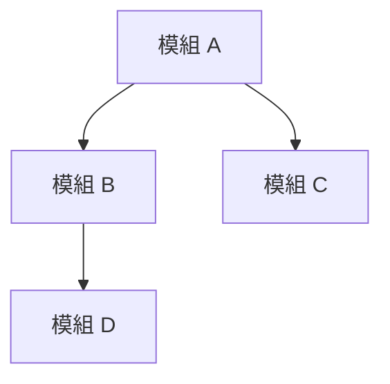
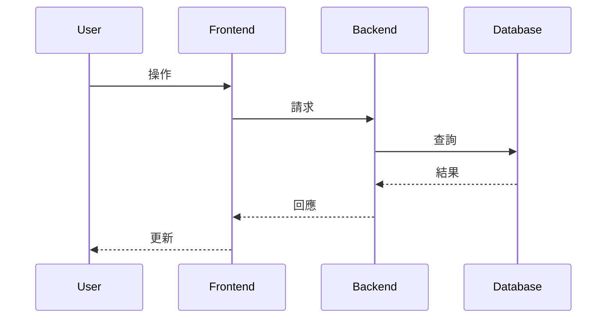

# Architecture: [系統名稱]

## 架構風格
[例如: 分層、六角、事件驅動]

理由: 2-3 句話。

## 模組分解

| 模組 | 用途 | 公開介面 | 依賴 |
|------|------|----------|------|
| ... | ... | ... | ... |

## 模組圖

## 關鍵序列

## 橫切面關注點

- **Logging**: [方式]
- **Error handling**: [方式]
- **Authentication**: [方式]
- **Observability**: [方式]

## 測試策略

- 單元測試: [模組邊界]
- 整合測試: [整合點]
- 端對端測試: [使用者流程]

## 實作順序

1. 模組 X（無依賴）
2. 模組 Y（依賴 X）
3. 模組 Z（依賴 Y）

## 風險

| # | 風險 | 嚴重度 | 緩解 |
|---|------|--------|------|
| 1 | ... | 高 | ... |
| 2 | ... | 中 | ... |
| 3 | ... | 中 | ... |
| 4 | ... | 低 | ... |
| 5 | ... | 低 | ... |
